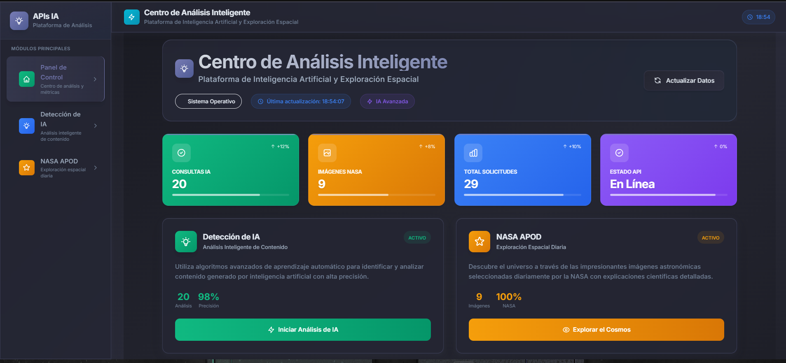
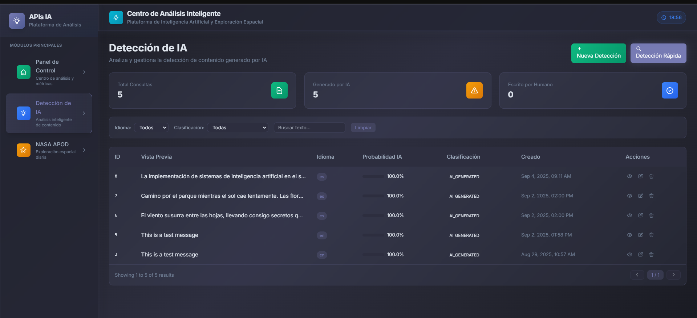
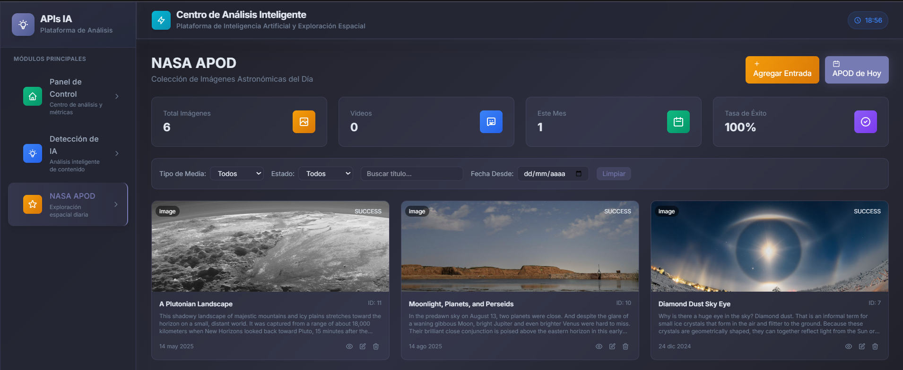

# 🚀 Centro de Análisis Inteligente

<div align="center">
  
  
  
  
</div>

---

## 🌟 **Plataforma de Inteligencia Artificial**

Esta aplicación web combina tecnologías modernas con la exploración del cosmos. Permite analizar contenido para detectar si fue generado por inteligencia artificial y explorar imágenes astronómicas de la NASA con explicaciones científicas.

---

## 📱 **Capturas de Pantalla**

### 🏠 Dashboard Principal


_Vista general del panel de control con estadísticas en tiempo real_

### 🤖 Análisis de IA


_Interfaz de detección y análisis de contenido generado por IA_

### 🌌 Exploración NASA


_Galería de imágenes astronómicas del día de la NASA_

---

## 🎯 **Funcionalidades del Sistema**

### 📊 **Panel de Control**

El panel principal muestra un resumen de todas las actividades del sistema. Aquí se pueden ver métricas importantes como el número de análisis de IA realizados y las imágenes de la NASA cargadas.

### 🔍 **Detección de Contenido IA**

Esta herramienta permite analizar textos para determinar si fueron escritos por humanos o generados por inteligencia artificial. Muestra el porcentaje de probabilidad y clasifica el contenido según el resultado.

### 🌌 **Explorador de Imágenes NASA**

Accede a una colección de imágenes y videos astronómicos seleccionados diariamente por la NASA. Cada imagen viene acompañada de una explicación científica detallada sobre el fenómeno astronómico mostrado.

---

## 🎨 **Características del Diseño**

### 🎨 **Interfaz Intuitiva**

- **Navegación sencilla** entre las diferentes secciones
- **Diseño responsive** que funciona en todos los dispositivos
- **Feedback visual** para todas las acciones del usuario

### 🎯 **Experiencia Educativa**

- **Contenido científico** de calidad proporcionado por la NASA
- **Herramientas de análisis** para comprender mejor el contenido
- **Visualizaciones claras** de los datos y resultados

---

## 🛠️ **Tecnologías Utilizadas**

| Área                 | Tecnología       | Propósito                             |
| -------------------- | ---------------- | ------------------------------------- |
| **Frontend**         | Angular 19       | Framework para la interfaz de usuario |
| **Lenguaje**         | TypeScript 5.7   | Desarrollo con tipado fuerte          |
| **Estilos**          | Tailwind CSS 3.4 | Sistema de diseño y estilos           |
| **Gestión de Datos** | RxJS             | Manejo reactivo de información        |
| **APIs Externas**    | NASA APOD API    | Datos astronómicos reales             |
| **Análisis IA**      | Custom AI API    | Servicio de detección de contenido    |

---

## 📦 **Instalación y Configuración**

### **Requisitos Previos**

Antes de comenzar, asegúrate de tener instalado:

- **Node.js** (versión 18.x o superior)
- **npm** (versión 9.x o superior)
- **Angular CLI** (versión 19.x)

### **Instalación**

1. **Clonar el repositorio**

   ```bash
   git clone <repository-url>
   cd <project-directory>
   ```

2. **Instalar dependencias**

   ```bash
   npm install
   ```

3. **Configurar variables de entorno**

   Edita los archivos de configuración de entorno según tu necesidad:

   **Desarrollo** (`src/environments/environment.ts`):

   ```typescript
   export const environment = {
     production: false,
     apiUrl: "http://localhost:8080", // URL del backend
     apiVersion: "v1",
     endpoints: {
       aiDetection: "/api/ai-detection",
       nasaApod: "/api/nasa-apod",
     },
     features: {
       autoRefresh: true,
       refreshInterval: 30000, // 30 segundos
       enableHistory: true,
       enableAnalytics: false,
     },
   };
   ```

   **Producción** (`src/environments/environment.prod.ts`):

   ```typescript
   export const environment = {
     production: true,
     apiUrl: "https://api.production.com", // URL del backend en producción
     apiVersion: "v1",
     endpoints: {
       aiDetection: "/api/ai-detection",
       nasaApod: "/api/nasa-apod",
     },
     features: {
       autoRefresh: true,
       refreshInterval: 60000, // 60 segundos
       enableHistory: true,
       enableAnalytics: true,
     },
   };
   ```

### **Ejecutar la Aplicación**

**Modo Desarrollo:**

```bash
npm start
# o
ng serve
```

La aplicación estará disponible en `http://localhost:4200`

**Modo Producción:**

```bash
npm run build
# o
ng build --configuration production
```

Los archivos compilados estarán en el directorio `dist/`

---

## 🎯 **Guía de Uso**

### **1. Dashboard Principal**

Al iniciar la aplicación, verás el dashboard con:

- **Estadísticas en tiempo real** de análisis de IA y consultas NASA
- **Últimas consultas** de ambos servicios
- **Accesos rápidos** a las funcionalidades principales
- **Registro de actividades** recientes

El dashboard se actualiza automáticamente cada 30 segundos.

### **2. Detección de Contenido IA**

**Analizar un texto:**

1. Navega a la sección "Detección de IA"
2. Ingresa o pega el texto que deseas analizar (mínimo 10 caracteres)
3. Selecciona el idioma (opcional - el sistema puede auto-detectar)
4. Haz clic en "Analizar Texto"

**Resultados:**

- **Clasificación**: AI_GENERATED, HUMAN_WRITTEN, MIXED_CONTENT, o UNCERTAIN
- **Probabilidad de IA**: Porcentaje de 0-100%
- **Idioma detectado**: Idioma del texto analizado
- **Indicadores visuales**: Colores según la clasificación
  - 🔴 Rojo: Generado por IA
  - 🟢 Verde: Escrito por humano
  - 🟡 Amarillo: Contenido mixto o incierto

**Ver Historial:**

- Accede al historial completo desde el botón "Ver Historial"
- Filtra por idioma
- Elimina consultas individuales o todo el historial
- Paginación automática para listas largas

### **3. Explorador NASA APOD**

**Buscar imágenes astronómicas:**

1. Navega a la sección "NASA APOD"
2. Selecciona una fecha (entre 1995-06-16 y hoy)
3. Haz clic en "Buscar Imagen" o "Hoy" para la imagen del día

**Información mostrada:**

- **Imagen o video** astronómico del día
- **Título** de la imagen
- **Fecha** de publicación
- **Explicación científica** detallada
- **Copyright** (si aplica)
- **Enlace HD** para imágenes de alta definición

**Ver Historial:**

- Accede al historial completo desde el botón "Ver Historial"
- Filtra por tipo de media (imagen/video)
- Busca por título
- Visualiza detalles completos de cada consulta
- Elimina consultas individuales o todo el historial

### **4. Navegación**

**Menú Principal:**

- 🏠 **Dashboard**: Vista general y estadísticas
- 🤖 **Detección IA**: Análisis de contenido
- 🌌 **NASA APOD**: Exploración espacial
- 📋 **Historial IA**: Consultas de detección anteriores
- 📋 **Historial NASA**: Imágenes consultadas anteriores

**Atajos de Teclado:**

- `Tab`: Navegar entre elementos
- `Enter/Space`: Activar botones y enlaces
- `Escape`: Cerrar modales

---

## ⚙️ **Variables de Entorno**

### **Configuración del Backend**

| Variable     | Descripción          | Valor por Defecto       |
| ------------ | -------------------- | ----------------------- |
| `apiUrl`     | URL base del backend | `http://localhost:8080` |
| `apiVersion` | Versión de la API    | `v1`                    |

### **Endpoints**

| Endpoint                             | Descripción                 |
| ------------------------------------ | --------------------------- |
| `/v1/api/ai-detection/detect`        | Detectar contenido IA       |
| `/v1/api/ai-detection/history`       | Historial de detecciones    |
| `/v1/api/ai-detection/history/count` | Contador de consultas       |
| `/v1/api/nasa-apod/today`            | Imagen del día actual       |
| `/v1/api/nasa-apod/date`             | Imagen por fecha específica |
| `/v1/api/nasa-apod/history`          | Historial de imágenes       |
| `/v1/api/nasa-apod/history/count`    | Contador de consultas       |

### **Features Flags**

| Flag              | Descripción                      | Valor por Defecto |
| ----------------- | -------------------------------- | ----------------- |
| `autoRefresh`     | Auto-actualización del dashboard | `true`            |
| `refreshInterval` | Intervalo de actualización (ms)  | `30000`           |
| `enableHistory`   | Habilitar historial              | `true`            |
| `enableAnalytics` | Habilitar analytics              | `false`           |

---

## 🧪 **Testing**

**Ejecutar tests unitarios:**

```bash
npm test
# o
ng test
```

**Ejecutar tests con cobertura:**

```bash
npm run test:coverage
# o
ng test --code-coverage
```

**Ejecutar linter:**

```bash
npm run lint
# o
ng lint
```

---

## 🚀 **Deployment**

### **Build para Producción**

```bash
npm run build:prod
# o
ng build --configuration production
```

### **Optimizaciones Incluidas**

- ✅ Minificación de código
- ✅ Tree-shaking
- ✅ Lazy loading de módulos
- ✅ Optimización de imágenes
- ✅ Compresión de assets
- ✅ Service Worker (PWA ready)

---

## 🌟 **Beneficios del Proyecto**

### 📚 **Aprendizaje**

- **Contenido educativo** sobre astronomía y ciencia
- **Herramientas para analizar** contenido digital
- **Experiencia interactiva** que facilita el aprendizaje

### 💻 **Tecnología**

- **Desarrollo moderno** con las últimas tecnologías web
- **Interfaz amigable** y fácil de usar
- **Sistema responsive** para todos los dispositivos

### ♿ **Accesibilidad**

- **Navegación por teclado** completa
- **Etiquetas ARIA** para lectores de pantalla
- **Contraste de colores** optimizado (WCAG 2.1 AA)
- **Tooltips informativos** en elementos interactivos

---

## 📝 **Estructura del Proyecto**

```
src/
├── app/
│   ├── core/                    # Servicios y modelos core
│   │   ├── models/              # Interfaces TypeScript
│   │   ├── services/            # Servicios HTTP
│   │   ├── interceptors/        # HTTP interceptors
│   │   └── validators/          # Validadores personalizados
│   ├── pages/                   # Componentes de página
│   │   ├── dashboard/           # Dashboard principal
│   │   ├── ai-detection/        # Detección de IA
│   │   └── nasa-apod/           # Explorador NASA
│   ├── shared/                  # Componentes compartidos
│   │   └── components/          # UI components reutilizables
│   ├── layouts/                 # Layouts de la aplicación
│   └── app.routes.ts            # Configuración de rutas
├── environments/                # Variables de entorno
└── styles.scss                  # Estilos globales
```

---

## 🤝 **Contribución**

Las contribuciones son bienvenidas. Por favor:

1. Fork el proyecto
2. Crea una rama para tu feature (`git checkout -b feature/AmazingFeature`)
3. Commit tus cambios (`git commit -m 'Add some AmazingFeature'`)
4. Push a la rama (`git push origin feature/AmazingFeature`)
5. Abre un Pull Request

---

## 📄 **Licencia**

Este proyecto está bajo la Licencia MIT. Ver el archivo `LICENSE` para más detalles.

---

<div align="center">
  <h3>🌟 Tecnología y Ciencia en una sola plataforma 🌟</h3>
  <p><i>"Donde el análisis inteligente se encuentra con la exploración espacial"</i></p>
  
  ---
  
  **Desarrollado con Angular 19 | TypeScript | Tailwind CSS**
  
  <p>⭐ Si te gusta este proyecto, dale una estrella en GitHub ⭐</p>
</div>
